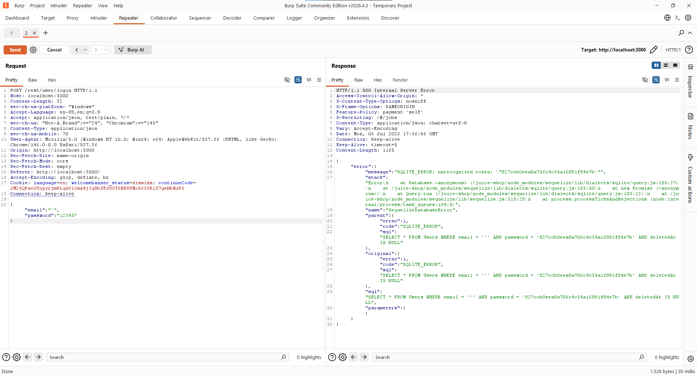
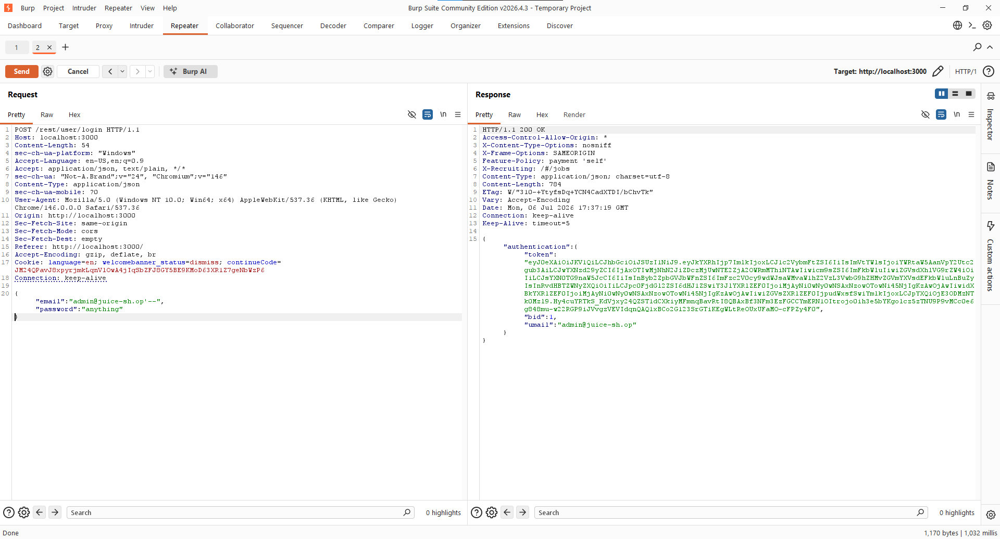
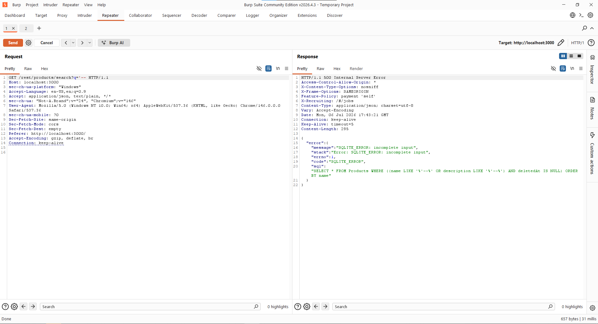
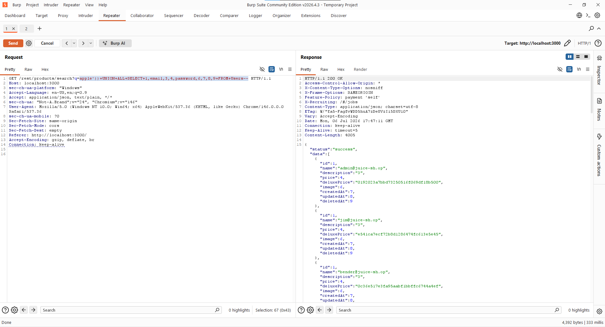

# SQL Injection in OWASP Juice Shop

**Course:** Cybersecurity Lab — Università degli Studi di Trieste
**Academic Year:** 2025/2026
**Student:** Abdelrahman Sharaf
**Target application:** OWASP Juice Shop (Docker image `bkimminich/juice-shop`)
**Submission folder:** `05_SQLI`

## 1. Objective and approach

The goal is to exploit two SQL Injection challenges in OWASP Juice Shop, one per category of attacker intent: bypassing authentication, and extracting data. The emphasis below is on how each exploit was discovered — the payloads are the end of a reasoning process, not lucky guesses.

The method was the same for both challenges, in three steps:

1. **Probe** — put a single quote in a field and watch for an HTTP 500 with a database error. A safely-written app returns a clean validation message; a SQL error means the input is reaching the query unescaped.
2. **Read** — use the query that the error leaks to reconstruct the exact SQL the server builds, quoting and parentheses included.
3. **Construct** — write the smallest payload that keeps the statement syntactically valid while changing what it means, and confirm it against the response.

## 2. Environment setup

- Started the container: `docker run --rm -p 3000:3000 bkimminich/juice-shop`
- Accessed the app at `http://localhost:3000`
- Registered a personal account and logged in with my own credentials.
- Used Burp Suite (Community Edition) as an intercepting proxy, editing and replaying the requests in Repeater.

## 3. Challenge 1 — Authentication Bypass

### 3.1 Detecting the injection and reading the query

**Probe.** The login is a `POST /rest/user/login` with a JSON body of `email` and `password`. I sent a single quote as the email:

```json
{"email":"'","password":"12345"}
```

A single quote is the canonical first probe: if the server pastes the email into a string literal, one unbalanced quote makes the statement invalid and the database throws. If the field were parameterised, the same input would just be a failed login (401), not a server error.

**What came back.** The response was HTTP 500, and the body returned the raw failing query:

```sql
SELECT * FROM Users
WHERE email = '<input>'
  AND password = '<md5(password)>'
  AND deletedAt IS NULL
```



Reading that one line decides the whole exploit:

- **(a)** the email is concatenated inside `'...'`, so it is the injection point;
- **(b)** the password is compared as an MD5 hash, not plaintext — `827ccb0eea8a706c4c34a16891f84e7b` is the MD5 of `12345` — so injecting through the password field is pointless;
- **(c)** a successful login is simply "this query returned a row." So if I can make the query return the admin row without a real password, I am logged in.

### 3.2 Building the bypass

From that query I need two things at once: the statement must stay valid, and the `password` / `deletedAt` checks must not run. Closing the email string right after a known address and starting a comment does both:

```json
{"email":"admin@juice-sh.op'--","password":"anything"}
```

**Why it works.** Substituted in, the query reads:

```sql
... WHERE email = 'admin@juice-sh.op'--' AND password = '...' AND deletedAt IS NULL
→  ... WHERE email = 'admin@juice-sh.op'
```

The `'` closes the literal and `--` turns the rest of the line into a comment, so the `AND password` and `deletedAt` clauses are discarded. The query returns the admin row and the app issues an administrator JWT.


**If I did not know the email.** `' OR 1=1--` reaches the same result by making the `WHERE` clause always true, so the query returns the first row in Users, which is the admin. I used the explicit `admin@juice-sh.op` because it is Juice Shop's documented default and Challenge 2 confirmed it independently.

## 4. Challenge 2 — Data Extraction (UNION)

### 4.1 Learning what a UNION here has to satisfy

**Goal and technique.** I want to read a different table (Users) through an endpoint that only queries Products. `UNION` is the tool: it appends a second SELECT whose rows are merged into the same result set the app returns, so user data comes back inside the product JSON. A UNION only works if three conditions hold, so the discovery is really about learning each one.

**Column count — from the normal response.** A plain search, `GET /rest/products/search?q=apple`, returns products whose JSON has nine fields:

```
id, name, description, price, deluxePrice, image, createdAt, updatedAt, deletedAt
```



That already answers the column-count question — the underlying SELECT returns nine columns, so my UNION SELECT must return nine too. I did not need to probe with `ORDER BY n` because the normal response gives it away.

**Break-out structure — from the error.** Probing with `q='--` returns HTTP 500 and leaks the products query:

```sql
SELECT * FROM Products
WHERE ((name LIKE '%<input>%' OR description LIKE '%<input>%')
       AND deletedAt IS NULL)
ORDER BY name
```



This shows my input lands inside `'%...%'`, wrapped in two parentheses `((`, that the term is used twice (name and description), and that there is a trailing `ORDER BY name`. So to inject cleanly I must close the string with `'`, close both parens with `))`, add my UNION, then comment out the leftovers — the second copy of the term, the closing `%'`, and `ORDER BY name` — with `--`.

### 4.2 Building the extraction

**Column positions — with markers.** Before putting real data in, I map which SELECT position surfaces where by sending integer markers `1..9` and reading the JSON: position 2 comes back as `name` and position 5 as `deluxePrice`, both text fields. Position 4 (`price`) is numeric, so a text value there could be coerced or error — which is why email and password go into 2 and 5 specifically, not just any slots.

**Final payload.** Placing email in column 2 and password in column 5:

```
apple')) UNION ALL SELECT 1,email,3,4,password,6,7,8,9 FROM Users--
```

`'))` closes the string and both parentheses; nine values match the nine columns; `--` comments out the rest of the original statement, including the second injected copy and `ORDER BY name`. I keep a space before `--` so it is cleanly separated from the last token — matching the request that succeeded; if the injection unexpectedly 500s, a missing or misplaced comment is the usual cause. The value is URL-encoded before sending because it contains spaces.

**Result.** The response is HTTP 200 and every "product" is now a user row — email in `name`, MD5 hash in `deluxePrice`:

```
"name":"admin@juice-sh.op",  "deluxePrice":"0192023a7bbd73250516f069df18b500"
"name":"jim@juice-sh.op",    "deluxePrice":"e541ca7ecf72b8d1286474fc613e5e45"
"name":"bender@juice-sh.op", ...
```



## 5. Root causes

- **Unparameterised queries.** Both endpoints build SQL by concatenating untrusted input directly into the query string (the `email` field and the `q` term), so the input is parsed as SQL rather than treated as data. This is the single shared cause.
- **Verbose error messages.** On a malformed query the app returns the raw SQL and stack trace. That information disclosure is exactly what let me reconstruct each query and build the payloads — without it, the same bugs would be far harder to exploit.
- **Comment-based truncation.** The `--` sequence let me drop the parts of the query I did not control — the password check in the login, the second term and `ORDER BY` in the search.
- **Over-privileged data access.** The product-search query runs against a context that can also read the Users table, which is what makes the UNION extraction possible.
- **Weak password storage (secondary).** Passwords are unsalted MD5, so the hashes dumped in Challenge 2 crack or look up almost instantly.

## 6. Takeaways and mitigations

- **Use parameterised queries / prepared statements** (or the ORM's binding) so input is always a bound parameter and can never change the query structure. This one change closes both vulnerabilities.
- **Return generic errors** to the client and log details server-side only, so the query structure is never disclosed.
- **Apply least privilege** to the database account so a product search cannot read Users.
- **Validate and allowlist input** as defence-in-depth — useful, but not a substitute for parameterisation.
- **Store passwords with a salted algorithm** such as bcrypt or Argon2 instead of MD5.
