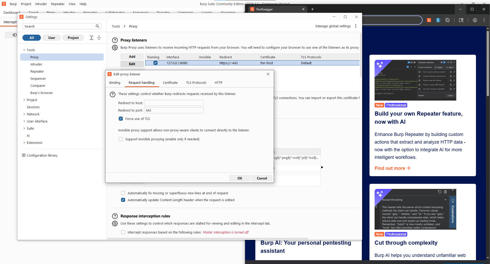
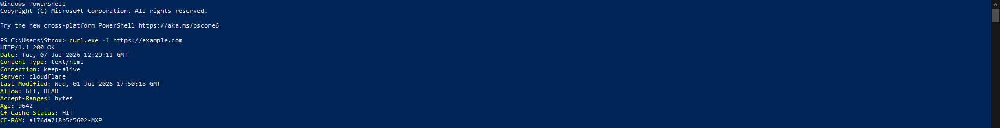
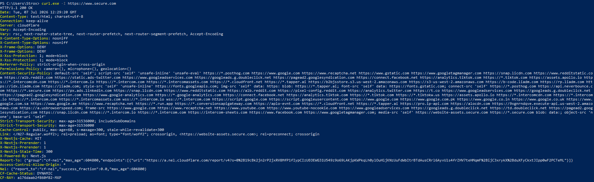
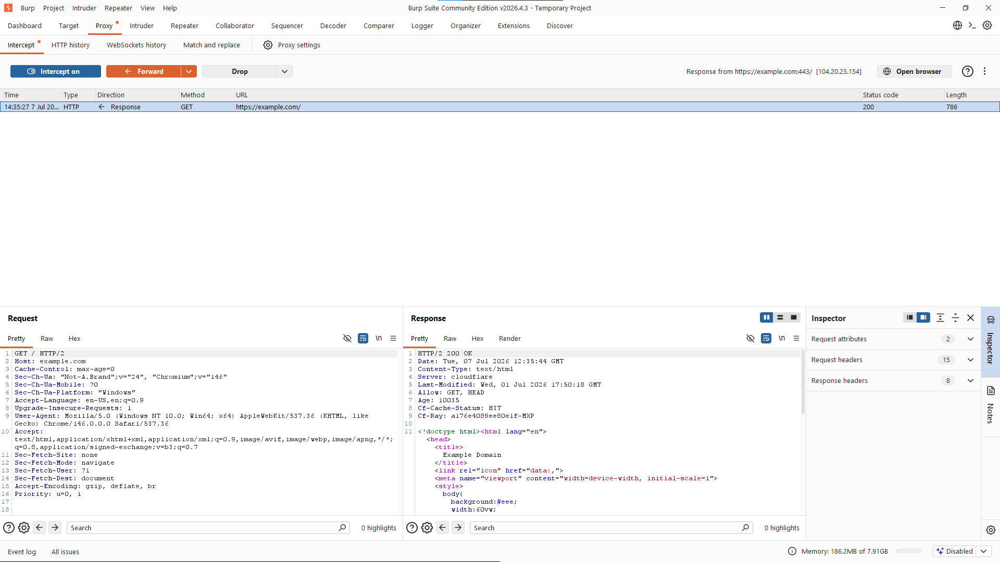
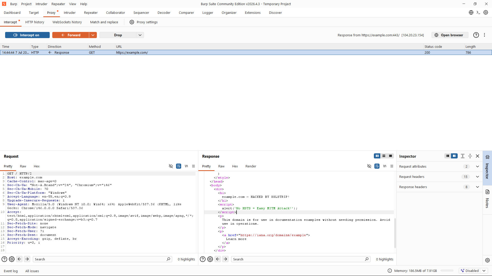
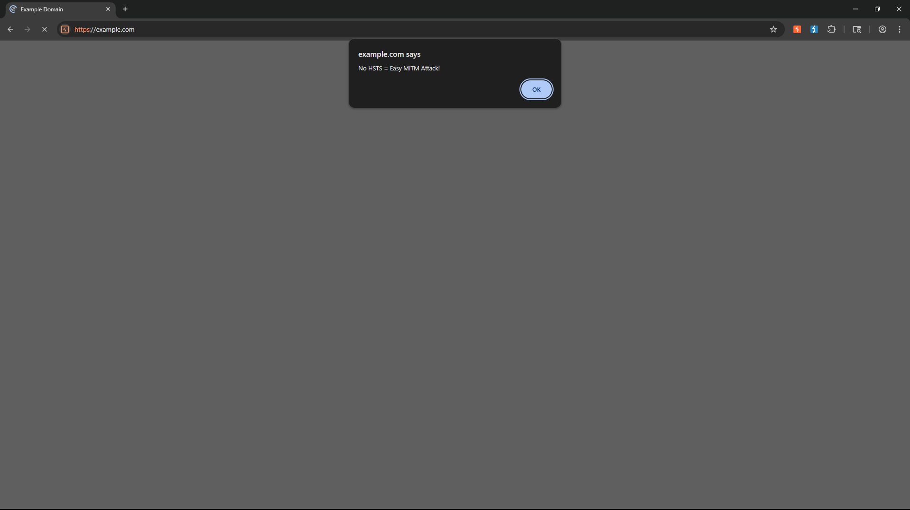
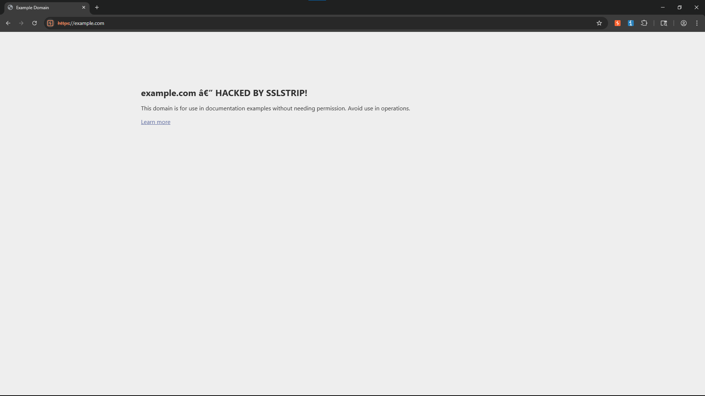
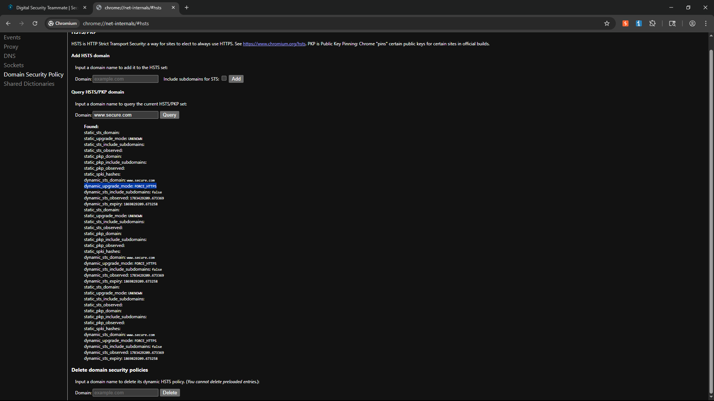
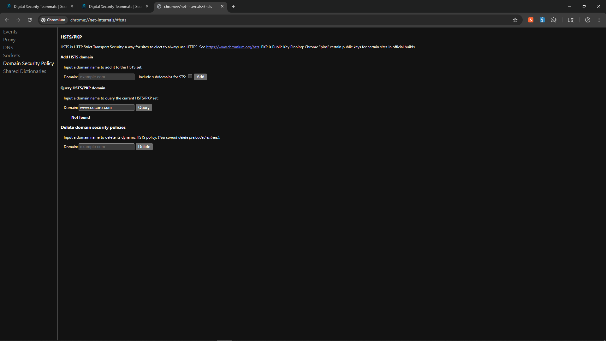

# AITM Lab 1 — HSTS vs SSLStrip

**Course:** Cybersecurity Lab · **Academic Year:** 2025/2026
**Student:** Abdelrahman Sharaf · **Submission folder:** `06_AITM_1`

---

## 1. What I set out to test

SSLStrip is a man-in-the-middle attack that keeps the victim's browser talking **HTTP** to the attacker while the attacker talks **HTTPS** to the real server. If nothing forces the browser onto HTTPS, the attacker sits on an unencrypted leg and can read and rewrite the page.

The thing that closes that door is **HSTS** (HTTP Strict Transport Security): once a browser has seen a site's `Strict-Transport-Security` header, it refuses plain HTTP for that host and upgrades to HTTPS on its own.

So the lab is really one question tested twice:

| Case | Site | HSTS | Expected |
|------|------|------|----------|
| **A** | `example.com` | none | attack **succeeds** |
| **B** | `www.secure.com` | enabled | attack **blocked** |

---

## 2. The proxy setup — and how it differs from "normal" Burp

In **normal** Burp usage the browser is proxy-aware and I've installed Burp's CA, so Burp can MITM the TLS itself: both legs (browser↔Burp and Burp↔server) are HTTPS and the browser still shows a padlock.

The **SSLStrip** configuration is the opposite idea. I force the victim leg to stay **plain HTTP** and only make the **upstream** leg use TLS:

- Settings → Tools → **Proxy** → Proxy listeners → **Edit** → **Request handling**
- **Redirect to port:** `443`
- **Force use of TLS:** ✔ (upstream only)
- **Redirect to host:** left blank (keep the original host)



The point of the difference: because the browser↔Burp leg is unencrypted, the victim gets **no certificate warning and no padlock** — that silence is exactly what makes a real SSLStrip attack stealthy, and it's why this config isn't how you'd normally drive Burp.

---

## 3. Probe — does the target force HTTPS?

I check the **HTTPS** endpoint of each site, not the HTTP one: a browser only reads and honours `Strict-Transport-Security` over HTTPS, so an STS header on an HTTP response would be meaningless.

**example.com** — no `strict-transport-security` in the response → nothing forces HTTPS → strippable.



**www.secure.com** — header present:

```
strict-transport-security: max-age=31536000
```



`max-age=31536000` is one year; note there's **no `includeSubDomains`** and **no `preload`**, so only `www.secure.com` itself is covered, and the policy is a *dynamic* one the browser learned on a prior HTTPS visit (this matters in Case B).

---

## 4. Case A — `example.com` (no HSTS): attack succeeds

**Probe → read → construct → why.**

I point the browser at `http://example.com`. Burp intercepts the response coming back from the server (fetched over TLS upstream, served to me over HTTP):



I then edit the response body before forwarding it — replacing the heading and injecting a script so the tampering is unmistakable:

```html
<h1>example.com — HACKED BY SSLSTRIP!</h1>
<script>alert('No HSTS = Easy MITM Attack!');</script>
```



The browser renders my version, still on `http://` with a **Not Secure** badge. The injected `alert()` fires first and blocks rendering until dismissed, so this is captured in two frames — the popup, then the defaced page after clicking OK:





**Why it works:** with no HSTS and the victim leg on plain HTTP, the browser never has any reason to upgrade to HTTPS. That leaves a MITM free to rewrite the body end-to-end. The alert popup is only the visible confirmation — the actual evidence is the edited response above and the `http://` request in HTTP history.

---

## 5. Case B — `www.secure.com` (HSTS enabled): attack blocked

First I confirm the browser is holding an HSTS policy for the host, at `chrome://net-internals/#hsts`:

```
dynamic_sts_domain: www.secure.com
dynamic_upgrade_mode: FORCE_HTTPS
```



Now I point the browser at `http://www.secure.com` with the same proxy setup. The browser **upgrades the request to HTTPS itself, before anything leaves it** — so the plain-HTTP leg the strip depends on never exists, and the real site loads:


**Why it's blocked:** HSTS is enforced client-side. The cached `FORCE_HTTPS` policy rewrites `http://` to `https://` at the browser, so there's no unencrypted response for Burp to tamper with.

### 5.1 The first-visit window (the part that actually matters)

HSTS only helps *after* the browser has learned the policy. On a genuine **first-ever visit** — before any HSTS header has been seen — the browser would still try HTTP, and SSLStrip would work. I reproduce that window by deleting the dynamic entry (net-internals → *Delete domain security policies*), which puts the browser in the same state as a first visitor:



With the policy gone, `http://www.secure.com` loads over plain HTTP again — **Not Secure**, and strippable:


This only works because the entry was **dynamic**. A **preloaded** entry can't be deleted (net-internals refuses it), which is what closes the first-visit gap for preload-listed sites.

---

## 6. Outcome

| | Case A — `example.com` | Case B — `www.secure.com` |
|---|---|---|
| HSTS | none | `max-age=31536000` (dynamic) |
| Browser stays on HTTP? | yes | no — upgraded to HTTPS |
| Response tampering | succeeds | blocked |
| Only failure mode for B | — | first visit / entry deleted (TOFU gap) |

**Takeaway:** without HSTS a MITM on the HTTP leg has full read/write over the page. With HSTS the browser forecloses the attack on its own — except in the trust-on-first-use window, which preloading removes.

---

## Screenshots to capture (your own run)

1. `01-burp-listener` — Request handling tab: Force TLS + redirect 443
2. `02-curl-example` — `curl -I https://example.com` (no STS)
3. `03-curl-secure` — `curl -I https://www.secure.com` (STS present)
4. `04-caseA-original` — intercepted original response
5. `05-caseA-modified` — edited response in Burp
6. `06a-caseA-alert` — injected alert popup over `http://` (Not Secure)
7. `06b-caseA-browser` — defaced page after clicking OK
8. `07-caseB-hsts-found` — net-internals, entry found, FORCE_HTTPS
9. `08-caseB-https` — browser auto-upgraded to HTTPS
10. `09-caseB-hsts-deleted` — net-internals after delete, Not found
11. `10-caseB-http-after-delete` — `http://` loads Not Secure after deletion
